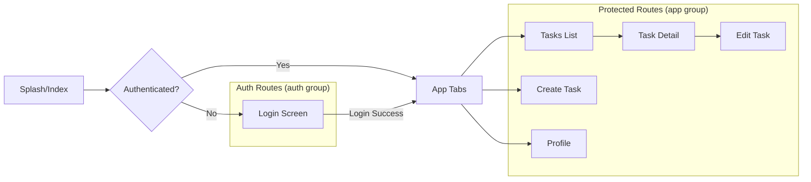

Complete Expo Router Structure & Navigation for CRUD App

## 📁 **Recommended File Structure**

```
my-app/
├── app/                          # Expo Router (app directory)
│   ├── (auth)/                   # Auth group (handles auth redirects)
│   │   ├── _layout.tsx          # Group layout (no header)
│   │   └── login.tsx            # Login screen (only shown if not authenticated)
│   ├── (app)/                    # App group (protected routes)
│   │   ├── _layout.tsx          # Main app layout with tabs
│   │   ├── index.tsx            # Home/Tasks list
│   │   ├── task/                # Task detail & edit
│   │   │   ├── [id].tsx         # Task detail view
│   │   │   └── edit/
│   │   │       └── [id].tsx     # Edit task form
│   │   ├── create.tsx           # Create new task
│   │   └── profile.tsx          # User profile
│   ├── _layout.tsx              # Root layout (handles auth state)
│   ├── index.tsx                # Initial redirect
│   └── +not-found.tsx           # 404 page
├── components/                   # Reusable components
│   ├── TaskList.tsx
│   ├── TaskForm.tsx
│   ├── TaskCard.tsx
│   ├── LoadingSpinner.tsx
│   ├── ErrorMessage.tsx
│   └── ProtectedRoute.tsx
├── lib/                          # Utilities & services
│   ├── api/
│   │   ├── index.ts             # API client setup
│   │   ├── auth.ts              # Auth API calls
│   │   └── tasks.ts             # Task CRUD API calls
│   ├── auth/
│   │   ├── index.ts             # Auth context/provider
│   │   └── useAuth.ts           # Auth hook
│   ├── constants/
│   │   └── config.ts            # App constants
│   └── utils/
│       ├── storage.ts           # AsyncStorage wrapper
│       └── validation.ts        # Form validation
├── hooks/                        # Custom React hooks
│   ├── useTasks.ts              # Task data management
│   └── useApi.ts                # Generic API hook
├── types/                        # TypeScript types
│   ├── task.ts
│   ├── user.ts
│   └── api.ts
├── assets/                       # Images, fonts, icons
│   ├── images/
│   └── fonts/
└── app.json
```

## 🔄 **Complete Implementation Files**

### **1. Root Layout (`app/_layout.tsx`)**
```tsx
import { Stack, useRouter, useSegments } from 'expo-router';
import { useEffect } from 'react';
import { useAuth } from '@/lib/auth/useAuth';
import { ActivityIndicator, View } from 'react-native';

export default function RootLayout() {
  const { user, isLoading, initialized } = useAuth();
  const segments = useSegments();
  const router = useRouter();

  useEffect(() => {
    if (!initialized) return;

    const inAuthGroup = segments[0] === '(auth)';
    const inAppGroup = segments[0] === '(app)';

    if (!user && !inAuthGroup) {
      // Redirect to login if not authenticated
      router.replace('/(auth)/login');
    } else if (user && !inAppGroup) {
      // Redirect to app if authenticated
      router.replace('/(app)');
    }
  }, [user, segments, initialized]);

  if (isLoading) {
    return (
      <View style={{ flex: 1, justifyContent: 'center', alignItems: 'center' }}>
        <ActivityIndicator size="large" />
      </View>
    );
  }

  return (
    <Stack screenOptions={{ headerShown: false }}>
      <Stack.Screen name="(auth)" options={{ headerShown: false }} />
      <Stack.Screen name="(app)" options={{ headerShown: false }} />
      <Stack.Screen name="+not-found" />
    </Stack>
  );
}
```

### **2. Auth Context (`lib/auth/index.tsx`)**
```tsx
import React, { createContext, useContext, useState, useEffect } from 'react';
import { User } from '@/types/user';
import { 
  loginWithGoogle, 
  logout, 
  getCurrentUser, 
  isAuthenticated 
} from '@/lib/api/auth';
import * as SecureStore from 'expo-secure-store';

interface AuthContextType {
  user: User | null;
  isLoading: boolean;
  initialized: boolean;
  login: () => Promise<void>;
  logout: () => Promise<void>;
  updateUser: (userData: Partial<User>) => void;
}

const AuthContext = createContext<AuthContextType | undefined>(undefined);

export function AuthProvider({ children }: { children: React.ReactNode }) {
  const [user, setUser] = useState<User | null>(null);
  const [isLoading, setIsLoading] = useState(true);
  const [initialized, setInitialized] = useState(false);

  useEffect(() => {
    checkAuthState();
  }, []);

  const checkAuthState = async () => {
    try {
      const authenticated = await isAuthenticated();
      if (authenticated) {
        const userData = await getCurrentUser();
        setUser(userData);
      }
    } catch (error) {
      console.error('Auth check error:', error);
      await SecureStore.deleteItemAsync('token');
    } finally {
      setIsLoading(false);
      setInitialized(true);
    }
  };

  const handleLogin = async () => {
    setIsLoading(true);
    try {
      const userData = await loginWithGoogle();
      setUser(userData);
    } catch (error) {
      console.error('Login error:', error);
      throw error;
    } finally {
      setIsLoading(false);
    }
  };

  const handleLogout = async () => {
    setIsLoading(true);
    try {
      await logout();
      setUser(null);
    } catch (error) {
      console.error('Logout error:', error);
      throw error;
    } finally {
      setIsLoading(false);
    }
  };

  const updateUser = (userData: Partial<User>) => {
    setUser(prev => prev ? { ...prev, ...userData } : null);
  };

  return (
    <AuthContext.Provider value={{
      user,
      isLoading,
      initialized,
      login: handleLogin,
      logout: handleLogout,
      updateUser
    }}>
      {children}
    </AuthContext.Provider>
  );
}

export const useAuth = () => {
  const context = useContext(AuthContext);
  if (!context) {
    throw new Error('useAuth must be used within an AuthProvider');
  }
  return context;
};
```

### **3. API Client (`lib/api/index.ts`)**
```tsx
import AsyncStorage from '@react-native-async-storage/async-storage';
import * as SecureStore from 'expo-secure-store';
import { Platform } from 'react-native';

const API_URL = process.env.EXPO_PUBLIC_API_URL;

class ApiClient {
  private refreshing = false;
  private refreshQueue: Array<{ resolve: (value: string) => void; reject: (reason?: any) => void }> = [];

  async getAccessToken() {
    if (Platform.OS === 'web') {
      return AsyncStorage.getItem('accessToken');
    }
    return SecureStore.getItemAsync('accessToken');
  }

  async setAccessToken(token: string) {
    if (Platform.OS === 'web') {
      return AsyncStorage.setItem('accessToken', token);
    }
    return SecureStore.setItemAsync('accessToken', token);
  }

  async getRefreshToken() {
    if (Platform.OS === 'web') {
      return AsyncStorage.getItem('refreshToken');
    }
    return SecureStore.getItemAsync('refreshToken');
  }

  async clearTokens() {
    if (Platform.OS === 'web') {
      await AsyncStorage.multiRemove(['accessToken', 'refreshToken', 'user']);
    } else {
      await SecureStore.deleteItemAsync('accessToken');
      await SecureStore.deleteItemAsync('refreshToken');
      await AsyncStorage.removeItem('user');
    }
  }

  async request(endpoint: string, options: RequestInit = {}) {
    const url = `${API_URL}${endpoint}`;
    let accessToken = await this.getAccessToken();

    const headers = {
      'Content-Type': 'application/json',
      ...(accessToken && { Authorization: `Bearer ${accessToken}` }),
      ...options.headers,
    };

    try {
      const response = await fetch(url, { ...options, headers });

      // Token expired, try to refresh
      if (response.status === 401 && accessToken) {
        accessToken = await this.refreshToken();
        headers.Authorization = `Bearer ${accessToken}`;
        
        // Retry with new token
        const retryResponse = await fetch(url, { ...options, headers });
        return this.handleResponse(retryResponse);
      }

      return this.handleResponse(response);
    } catch (error) {
      console.error('API request error:', error);
      throw error;
    }
  }

  private async refreshToken(): Promise<string> {
    // If already refreshing, wait in queue
    if (this.refreshing) {
      return new Promise((resolve, reject) => {
        this.refreshQueue.push({ resolve, reject });
      });
    }

    this.refreshing = true;

    try {
      const refreshToken = await this.getRefreshToken();
      if (!refreshToken) {
        throw new Error('No refresh token available');
      }

      const response = await fetch(`${API_URL}/auth/refresh`, {
        method: 'POST',
        headers: { 'Content-Type': 'application/json' },
        body: JSON.stringify({ refreshToken }),
      });

      if (!response.ok) {
        await this.clearTokens();
        throw new Error('Refresh token failed');
      }

      const data = await response.json();
      await this.setAccessToken(data.token);
      
      // Resolve all waiting requests
      this.refreshQueue.forEach(({ resolve }) => resolve(data.token));
      this.refreshQueue = [];
      
      return data.token;
    } catch (error) {
      // Reject all waiting requests
      this.refreshQueue.forEach(({ reject }) => reject(error));
      this.refreshQueue = [];
      throw error;
    } finally {
      this.refreshing = false;
    }
  }

  private async handleResponse(response: Response) {
    const data = await response.json().catch(() => ({}));

    if (!response.ok) {
      throw {
        status: response.status,
        message: data.error || 'Request failed',
        data
      };
    }

    return data;
  }

  get(endpoint: string) {
    return this.request(endpoint, { method: 'GET' });
  }

  post(endpoint: string, body: any) {
    return this.request(endpoint, {
      method: 'POST',
      body: JSON.stringify(body)
    });
  }

  put(endpoint: string, body: any) {
    return this.request(endpoint, {
      method: 'PUT',
      body: JSON.stringify(body)
    });
  }

  delete(endpoint: string) {
    return this.request(endpoint, { method: 'DELETE' });
  }
}

export const api = new ApiClient();
```

### **4. Tasks API (`lib/api/tasks.ts`)**
```tsx
import { api } from './index';
import { Task, CreateTaskInput, UpdateTaskInput } from '@/types/task';

export const tasksApi = {
  // Get all tasks with pagination
  getAll: async (params?: { page?: number; limit?: number; status?: string }) => {
    const query = new URLSearchParams();
    if (params?.page) query.append('page', params.page.toString());
    if (params?.limit) query.append('limit', params.limit.toString());
    if (params?.status) query.append('status', params.status);
    
    const queryString = query.toString();
    return api.get(`/tasks${queryString ? `?${queryString}` : ''}`);
  },

  // Get single task
  getById: async (id: string) => {
    return api.get(`/tasks/${id}`);
  },

  // Create task
  create: async (data: CreateTaskInput) => {
    return api.post('/tasks', data);
  },

  // Update task
  update: async (id: string, data: UpdateTaskInput) => {
    return api.put(`/tasks/${id}`, data);
  },

  // Delete task
  delete: async (id: string) => {
    return api.delete(`/tasks/${id}`);
  },

  // Toggle task completion
  toggleComplete: async (id: string, completed: boolean) => {
    return api.put(`/tasks/${id}/complete`, { completed });
  }
};
```

### **5. Task Hook (`hooks/useTasks.ts`)**
```tsx
import { useState, useCallback } from 'react';
import { tasksApi } from '@/lib/api/tasks';
import { Task } from '@/types/task';

export const useTasks = () => {
  const [tasks, setTasks] = useState<Task[]>([]);
  const [loading, setLoading] = useState(false);
  const [error, setError] = useState<string | null>(null);
  const [pagination, setPagination] = useState({
    page: 1,
    limit: 20,
    total: 0,
    hasMore: true
  });

  const fetchTasks = useCallback(async (params?: {
    page?: number;
    limit?: number;
    status?: string;
    refresh?: boolean;
  }) => {
    const page = params?.page || pagination.page;
    const limit = params?.limit || pagination.limit;
    
    if (!params?.refresh && !pagination.hasMore) return;

    setLoading(true);
    setError(null);

    try {
      const response = await tasksApi.getAll({
        page,
        limit,
        status: params?.status
      });

      setTasks(prev => {
        if (params?.refresh || page === 1) {
          return response.tasks;
        }
        return [...prev, ...response.tasks];
      });

      setPagination({
        page: response.meta.page,
        limit: response.meta.limit,
        total: response.meta.total,
        hasMore: response.meta.page * response.meta.limit < response.meta.total
      });

      return response;
    } catch (err: any) {
      setError(err.message || 'Failed to fetch tasks');
      throw err;
    } finally {
      setLoading(false);
    }
  }, [pagination]);

  const createTask = useCallback(async (data: { title: string; description?: string }) => {
    setLoading(true);
    try {
      const response = await tasksApi.create(data);
      setTasks(prev => [response.task, ...prev]);
      return response.task;
    } catch (err: any) {
      setError(err.message || 'Failed to create task');
      throw err;
    } finally {
      setLoading(false);
    }
  }, []);

  const updateTask = useCallback(async (id: string, data: Partial<Task>) => {
    setLoading(true);
    try {
      const response = await tasksApi.update(id, data);
      setTasks(prev => prev.map(task => 
        task.id === id ? { ...task, ...response.task } : task
      ));
      return response.task;
    } catch (err: any) {
      setError(err.message || 'Failed to update task');
      throw err;
    } finally {
      setLoading(false);
    }
  }, []);

  const deleteTask = useCallback(async (id: string) => {
    setLoading(true);
    try {
      await tasksApi.delete(id);
      setTasks(prev => prev.filter(task => task.id !== id));
    } catch (err: any) {
      setError(err.message || 'Failed to delete task');
      throw err;
    } finally {
      setLoading(false);
    }
  }, []);

  const toggleTaskComplete = useCallback(async (id: string, completed: boolean) => {
    try {
      await tasksApi.toggleComplete(id, completed);
      setTasks(prev => prev.map(task => 
        task.id === id ? { ...task, completed, updatedAt: new Date().toISOString() } : task
      ));
    } catch (err: any) {
      setError(err.message || 'Failed to update task');
      throw err;
    }
  }, []);

  return {
    tasks,
    loading,
    error,
    pagination,
    fetchTasks,
    createTask,
    updateTask,
    deleteTask,
    toggleTaskComplete,
    setError
  };
};
```

### **6. App Layout with Tabs (`app/(app)/_layout.tsx`)**
```tsx
import { Tabs } from 'expo-router';
import { Ionicons } from '@expo/vector-icons';
import { useAuth } from '@/lib/auth/useAuth';
import { TouchableOpacity, View, Text } from 'react-native';

export default function AppLayout() {
  const { user, logout } = useAuth();

  return (
    <Tabs
      screenOptions={{
        tabBarActiveTintColor: '#007AFF',
        tabBarInactiveTintColor: '#8E8E93',
        headerStyle: {
          backgroundColor: '#f5f5f5',
        },
        headerTitleStyle: {
          fontWeight: '600',
        },
        headerRight: () => (
          <TouchableOpacity
            onPress={logout}
            style={{ marginRight: 15 }}
          >
            <Text style={{ color: '#007AFF' }}>Logout</Text>
          </TouchableOpacity>
        ),
        headerLeft: () => (
          <View style={{ marginLeft: 15 }}>
            <Text style={{ fontSize: 14, color: '#666' }}>
              Hi, {user?.name?.split(' ')[0] || 'User'}
            </Text>
          </View>
        ),
      }}
    >
      <Tabs.Screen
        name="index"
        options={{
          title: 'Tasks',
          tabBarIcon: ({ color, size }) => (
            <Ionicons name="list" size={size} color={color} />
          ),
        }}
      />
      <Tabs.Screen
        name="create"
        options={{
          title: 'Create',
          tabBarIcon: ({ color, size }) => (
            <Ionicons name="add-circle" size={size} color={color} />
          ),
        }}
      />
      <Tabs.Screen
        name="profile"
        options={{
          title: 'Profile',
          tabBarIcon: ({ color, size }) => (
            <Ionicons name="person" size={size} color={color} />
          ),
        }}
      />
      <Tabs.Screen
        name="task/[id]"
        options={{
          href: null, // Hide from tab bar
        }}
      />
      <Tabs.Screen
        name="task/edit/[id]"
        options={{
          href: null, // Hide from tab bar
        }}
      />
    </Tabs>
  );
}
```

### **7. Tasks List Screen (`app/(app)/index.tsx`)**
```tsx
import React, { useEffect, useState } from 'react';
import {
  View,
  FlatList,
  TextInput,
  TouchableOpacity,
  Text,
  RefreshControl,
  Alert,
  ActivityIndicator,
} from 'react-native';
import { useRouter } from 'expo-router';
import { Ionicons } from '@expo/vector-icons';
import TaskCard from '@/components/TaskCard';
import { useTasks } from '@/hooks/useTasks';
import { Task } from '@/types/task';

export default function TasksScreen() {
  const router = useRouter();
  const {
    tasks,
    loading,
    error,
    fetchTasks,
    deleteTask,
    toggleTaskComplete,
    pagination
  } = useTasks();
  
  const [searchQuery, setSearchQuery] = useState('');
  const [filter, setFilter] = useState<'all' | 'pending' | 'completed'>('all');
  const [refreshing, setRefreshing] = useState(false);

  useEffect(() => {
    loadTasks();
  }, [filter]);

  const loadTasks = async (page = 1) => {
    try {
      await fetchTasks({
        page,
        status: filter === 'all' ? undefined : filter,
        refresh: page === 1
      });
    } catch (err) {
      Alert.alert('Error', 'Failed to load tasks');
    }
  };

  const onRefresh = async () => {
    setRefreshing(true);
    await loadTasks(1);
    setRefreshing(false);
  };

  const handleDelete = (task: Task) => {
    Alert.alert(
      'Delete Task',
      `Are you sure you want to delete "${task.title}"?`,
      [
        { text: 'Cancel', style: 'cancel' },
        {
          text: 'Delete',
          style: 'destructive',
          onPress: async () => {
            try {
              await deleteTask(task.id);
            } catch (err) {
              Alert.alert('Error', 'Failed to delete task');
            }
          }
        }
      ]
    );
  };

  const handleToggleComplete = async (task: Task) => {
    try {
      await toggleTaskComplete(task.id, !task.completed);
    } catch (err) {
      Alert.alert('Error', 'Failed to update task');
    }
  };

  const filteredTasks = tasks.filter(task => {
    const matchesSearch = task.title.toLowerCase().includes(searchQuery.toLowerCase()) ||
                         task.description?.toLowerCase().includes(searchQuery.toLowerCase());
    const matchesFilter = filter === 'all' ||
                         (filter === 'completed' && task.completed) ||
                         (filter === 'pending' && !task.completed);
    return matchesSearch && matchesFilter;
  });

  const renderTask = ({ item }: { item: Task }) => (
    <TaskCard
      task={item}
      onPress={() => router.push(`/task/${item.id}`)}
      onEdit={() => router.push(`/task/edit/${item.id}`)}
      onDelete={() => handleDelete(item)}
      onToggleComplete={() => handleToggleComplete(item)}
    />
  );

  const renderEmpty = () => (
    <View style={{ flex: 1, justifyContent: 'center', alignItems: 'center', padding: 20 }}>
      <Ionicons name="checkmark-done-circle" size={64} color="#ccc" />
      <Text style={{ marginTop: 16, fontSize: 16, color: '#666' }}>
        {filter === 'completed' 
          ? 'No completed tasks yet'
          : filter === 'pending'
          ? 'No pending tasks'
          : 'No tasks yet. Create your first task!'}
      </Text>
    </View>
  );

  return (
    <View style={{ flex: 1, backgroundColor: '#f5f5f5' }}>
      {/* Search and Filter Bar */}
      <View style={{ padding: 16, backgroundColor: 'white' }}>
        <View style={{ flexDirection: 'row', marginBottom: 12 }}>
          <View style={{ flex: 1, flexDirection: 'row', alignItems: 'center', backgroundColor: '#f0f0f0', borderRadius: 8, paddingHorizontal: 12 }}>
            <Ionicons name="search" size={20} color="#666" />
            <TextInput
              style={{ flex: 1, padding: 12, fontSize: 16 }}
              placeholder="Search tasks..."
              value={searchQuery}
              onChangeText={setSearchQuery}
            />
            {searchQuery ? (
              <TouchableOpacity onPress={() => setSearchQuery('')}>
                <Ionicons name="close-circle" size={20} color="#666" />
              </TouchableOpacity>
            ) : null}
          </View>
        </View>

        {/* Filter Chips */}
        <View style={{ flexDirection: 'row', gap: 8 }}>
          {(['all', 'pending', 'completed'] as const).map((filterType) => (
            <TouchableOpacity
              key={filterType}
              onPress={() => setFilter(filterType)}
              style={{
                paddingHorizontal: 16,
                paddingVertical: 8,
                borderRadius: 20,
                backgroundColor: filter === filterType ? '#007AFF' : '#f0f0f0',
              }}
            >
              <Text style={{
                color: filter === filterType ? 'white' : '#666',
                fontWeight: filter === filterType ? '600' : '400',
              }}>
                {filterType.charAt(0).toUpperCase() + filterType.slice(1)}
              </Text>
            </TouchableOpacity>
          ))}
        </View>
      </View>

      {/* Task List */}
      <FlatList
        data={filteredTasks}
        renderItem={renderTask}
        keyExtractor={(item) => item.id}
        contentContainerStyle={{ padding: 16 }}
        ListEmptyComponent={renderEmpty}
        refreshControl={
          <RefreshControl refreshing={refreshing} onRefresh={onRefresh} />
        }
        onEndReached={() => {
          if (pagination.hasMore && !loading) {
            loadTasks(pagination.page + 1);
          }
        }}
        onEndReachedThreshold={0.5}
        ListFooterComponent={() => {
          if (loading && tasks.length > 0) {
            return (
              <View style={{ padding: 20 }}>
                <ActivityIndicator size="small" color="#007AFF" />
              </View>
            );
          }
          return null;
        }}
      />

      {/* Error Message */}
      {error && (
        <View style={{ padding: 16, backgroundColor: '#FF3B30', margin: 16, borderRadius: 8 }}>
          <Text style={{ color: 'white' }}>{error}</Text>
        </View>
      )}
    </View>
  );
}
```

### **8. Task Detail Screen (`app/(app)/task/[id].tsx`)**
```tsx
import React, { useEffect, useState } from 'react';
import {
  View,
  Text,
  ScrollView,
  TouchableOpacity,
  Alert,
  ActivityIndicator,
  StyleSheet,
} from 'react-native';
import { useLocalSearchParams, useRouter } from 'expo-router';
import { Ionicons } from '@expo/vector-icons';
import { tasksApi } from '@/lib/api/tasks';
import { Task } from '@/types/task';

export default function TaskDetailScreen() {
  const { id } = useLocalSearchParams<{ id: string }>();
  const router = useRouter();
  const [task, setTask] = useState<Task | null>(null);
  const [loading, setLoading] = useState(true);
  const [error, setError] = useState<string | null>(null);

  useEffect(() => {
    loadTask();
  }, [id]);

  const loadTask = async () => {
    try {
      setLoading(true);
      const data = await tasksApi.getById(id);
      setTask(data.task);
    } catch (err: any) {
      setError(err.message || 'Failed to load task');
      Alert.alert('Error', 'Failed to load task details');
    } finally {
      setLoading(false);
    }
  };

  const handleDelete = () => {
    Alert.alert(
      'Delete Task',
      'Are you sure you want to delete this task?',
      [
        { text: 'Cancel', style: 'cancel' },
        {
          text: 'Delete',
          style: 'destructive',
          onPress: async () => {
            try {
              await tasksApi.delete(id);
              router.back();
            } catch (err) {
              Alert.alert('Error', 'Failed to delete task');
            }
          }
        }
      ]
    );
  };

  const handleToggleComplete = async () => {
    if (!task) return;
    try {
      await tasksApi.toggleComplete(id, !task.completed);
      setTask({ ...task, completed: !task.completed });
    } catch (err) {
      Alert.alert('Error', 'Failed to update task');
    }
  };

  if (loading) {
    return (
      <View style={styles.center}>
        <ActivityIndicator size="large" color="#007AFF" />
      </View>
    );
  }

  if (error || !task) {
    return (
      <View style={styles.center}>
        <Ionicons name="alert-circle" size={64} color="#FF3B30" />
        <Text style={styles.errorText}>
          {error || 'Task not found'}
        </Text>
        <TouchableOpacity
          style={styles.retryButton}
          onPress={loadTask}
        >
          <Text style={styles.retryText}>Retry</Text>
        </TouchableOpacity>
      </View>
    );
  }

  return (
    <ScrollView style={styles.container}>
      <View style={styles.header}>
        <View style={styles.titleRow}>
          <TouchableOpacity
            style={[
              styles.completionIndicator,
              task.completed && styles.completedIndicator
            ]}
            onPress={handleToggleComplete}
          >
            <Ionicons
              name={task.completed ? 'checkmark-circle' : 'ellipse-outline'}
              size={24}
              color={task.completed ? '#34C759' : '#C7C7CC'}
            />
          </TouchableOpacity>
          <Text style={styles.title}>{task.title}</Text>
        </View>
        
        <Text style={styles.date}>
          Created: {new Date(task.createdAt).toLocaleDateString()}
        </Text>
        {task.updatedAt !== task.createdAt && (
          <Text style={styles.date}>
            Updated: {new Date(task.updatedAt).toLocaleDateString()}
          </Text>
        )}
      </View>

      {task.description && (
        <View style={styles.section}>
          <Text style={styles.sectionTitle}>Description</Text>
          <Text style={styles.description}>{task.description}</Text>
        </View>
      )}

      <View style={styles.actions}>
        <TouchableOpacity
          style={[styles.actionButton, styles.editButton]}
          onPress={() => router.push(`/task/edit/${id}`)}
        >
          <Ionicons name="pencil" size={20} color="white" />
          <Text style={styles.actionText}>Edit</Text>
        </TouchableOpacity>

        <TouchableOpacity
          style={[styles.actionButton, styles.deleteButton]}
          onPress={handleDelete}
        >
          <Ionicons name="trash" size={20} color="white" />
          <Text style={styles.actionText}>Delete</Text>
        </TouchableOpacity>

        <TouchableOpacity
          style={[styles.actionButton, styles.toggleButton]}
          onPress={handleToggleComplete}
        >
          <Ionicons
            name={task.completed ? 'close-circle' : 'checkmark-circle'}
            size={20}
            color="white"
          />
          <Text style={styles.actionText}>
            {task.completed ? 'Mark as Pending' : 'Mark as Complete'}
          </Text>
        </TouchableOpacity>
      </View>
    </ScrollView>
  );
}

const styles = StyleSheet.create({
  container: {
    flex: 1,
    backgroundColor: '#f5f5f5',
  },
  center: {
    flex: 1,
    justifyContent: 'center',
    alignItems: 'center',
    padding: 20,
  },
  errorText: {
    marginTop: 16,
    fontSize: 16,
    color: '#FF3B30',
    textAlign: 'center',
  },
  retryButton: {
    marginTop: 16,
    paddingHorizontal: 24,
    paddingVertical: 12,
    backgroundColor: '#007AFF',
    borderRadius: 8,
  },
  retryText: {
    color: 'white',
    fontWeight: '600',
  },
  header: {
    backgroundColor: 'white',
    padding: 20,
    marginBottom: 16,
  },
  titleRow: {
    flexDirection: 'row',
    alignItems: 'center',
    marginBottom: 12,
  },
  completionIndicator: {
    marginRight: 12,
  },
  completedIndicator: {
    // Add any completed-specific styles
  },
  title: {
    fontSize: 24,
    fontWeight: '700',
    flex: 1,
  },
  date: {
    fontSize: 14,
    color: '#8E8E93',
    marginTop: 4,
  },
  section: {
    backgroundColor: 'white',
    padding: 20,
    marginBottom: 16,
  },
  sectionTitle: {
    fontSize: 18,
    fontWeight: '600',
    marginBottom: 12,
    color: '#1C1C1E',
  },
  description: {
    fontSize: 16,
    lineHeight: 24,
    color: '#3C3C43',
  },
  actions: {
    flexDirection: 'row',
    flexWrap: 'wrap',
    gap: 12,
    padding: 20,
  },
  actionButton: {
    flexDirection: 'row',
    alignItems: 'center',
    justifyContent: 'center',
    paddingHorizontal: 20,
    paddingVertical: 12,
    borderRadius: 8,
    flex: 1,
    minWidth: 120,
  },
  editButton: {
    backgroundColor: '#007AFF',
  },
  deleteButton: {
    backgroundColor: '#FF3B30',
  },
  toggleButton: {
    backgroundColor: '#34C759',
  },
  actionText: {
    color: 'white',
    fontWeight: '600',
    marginLeft: 8,
  },
});
```

### **9. Types (`types/task.ts`)**
```typescript
export interface Task {
  id: string;
  title: string;
  description?: string;
  completed: boolean;
  userId: string;
  createdAt: string;
  updatedAt: string;
}

export interface CreateTaskInput {
  title: string;
  description?: string;
}

export interface UpdateTaskInput extends Partial<CreateTaskInput> {
  completed?: boolean;
}

export interface TasksResponse {
  tasks: Task[];
  meta: {
    page: number;
    limit: number;
    total: number;
    totalPages: number;
  };
}
```

### **10. TypeScript Configuration (`tsconfig.json`)**
```json
{
  "extends": "expo/tsconfig.base",
  "compilerOptions": {
    "strict": true,
    "paths": {
      "@/*": ["./*"]
    },
    "allowSyntheticDefaultImports": true,
    "esModuleInterop": true,
    "skipLibCheck": true,
    "forceConsistentCasingInFileNames": true
  },
  "include": [
    "**/*.ts",
    "**/*.tsx",
    ".expo/types/**/*.ts",
    "expo-env.d.ts"
  ]
}
```

## 🚀 **Navigation Flow Diagram**



## 📱 **Complete Navigation Map**

| Route | Purpose | Navigation |
|-------|---------|------------|
| `/` | Initial redirect | Auto to login or app |
| `/login` | Google Sign-In | `router.replace('/(app)')` |
| `/tasks` | Task list (tab) | Default tab view |
| `/create` | Create task (tab) | Tab navigation |
| `/profile` | User profile (tab) | Tab navigation |
| `/task/[id]` | Task detail | `router.push('/task/123')` |
| `/task/edit/[id]` | Edit task | `router.push('/task/edit/123')` |

## 🎯 **Key Features Implemented**

1. **Authentication Flow**: Auto-redirect based on auth state
2. **Tab Navigation**: Main app navigation with tabs
3. **Stack Navigation**: For detail/edit screens
4. **CRUD Operations**: Complete task management
5. **State Management**: React hooks for data
6. **Error Handling**: Graceful error states
7. **Loading States**: Activity indicators
8. **Pull-to-Refresh**: List refreshing
9. **Infinite Scroll**: Pagination support
10. **Search & Filter**: Task filtering

This structure gives you a production-ready CRUD app with Google authentication, proper navigation, and clean code organization. The Expo Router file-based routing makes navigation intuitive and type-safe.


